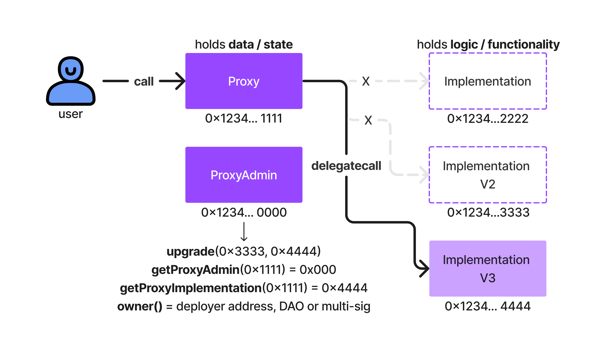

## Upgradeable Smart Contracts

## Why Upgrade Smart Contracts?
By design, smart contracts are immutable. On the other hand, software quality heavily depends on the ability to upgrade and patch source code in order to produce iterative releases.

In short, if you want to make your smart-contract-based software be based on a more iterative approach, you can still do so and are not constrained by set-in-stone immutability. It is up to you to determine whether your dApp will require upgradeable software infrastructure!

## How Do Upgradeable Smart Contracts Work?
Upgradeable smart contracts are a pattern composed of THREE contracts:

- Proxy contract: The smart contract the user interacts with directly.
This contracts holds the contract state (ie, the important data is held here!).
This is an EIP1967 standard proxy contract.
This proxy contract is in charge of forwarding transactions to the implementation contract, the one containing the pure logic.
- Implementation contract: The smart contract that provides the skeleton logic and data.
This is where you instantiate your variables. Your proxy contract, via delegatecalls into this one, will give them value!
- ProxyAdmin contract: The contract links Proxy and Implementation.
This contract holds authority over Proxy to upgrade the Proxy contract and thus link that proxy to a new implementation contract.

## Visualization: Upgrading a Smart Contract from V2 to V3



The above diagram shows what is called the transparent proxy pattern. This pattern uses call, delegatecall and the three-contract design in order to achieve a super cool infrastrastructure. 💥

Here is a breakdown of the diagram flow, from the user perspective:

1. The user performs a call into the Proxy contract
2. That call hits the fallback function of the Proxy contract which is directly rigged to delegatecall into the Implementation contract address
3. In performing a delegatecall, the context of the Proxy contract is forwarded. This means that the storage of 0x1234.1111 will be directly affected by the logic of 0x1234.4444 (that's the whole point of delegatecall!)
4. The logic from Implementation is performed on the state of Proxy and if the logic does not revert, the state is returned to Proxy which then returns a receipt to the original user
5. Transaction over!  🧾


Try running some of the following tasks:

```shell
# deploy v1
npx hardhat run scripts/deployProxy.js --network goerli

# upgrade to v2
npx hardhat run scripts/upgradeProxy.js --network goerli

```
